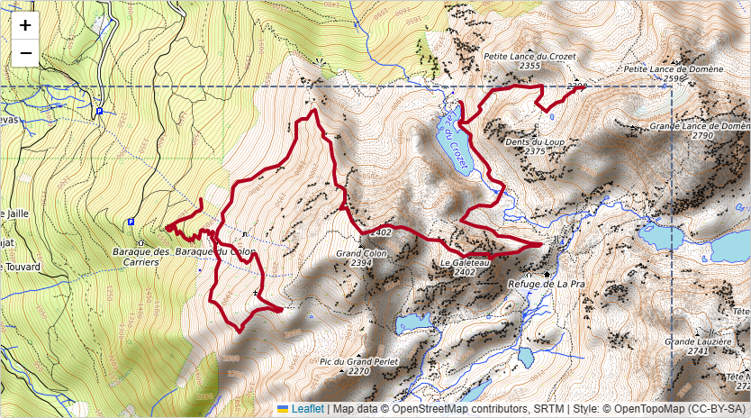
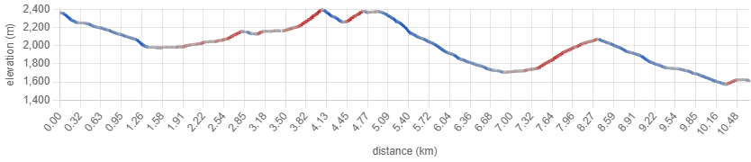
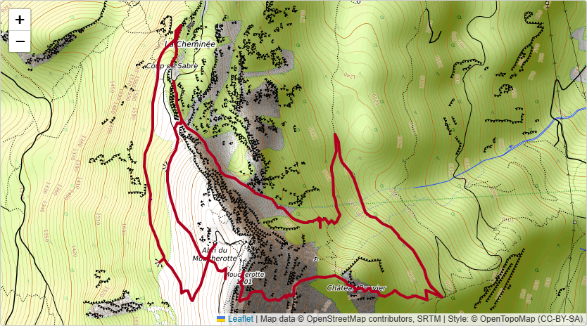
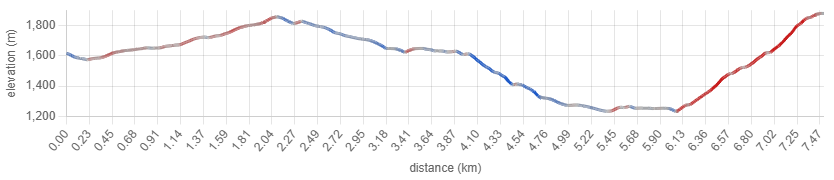
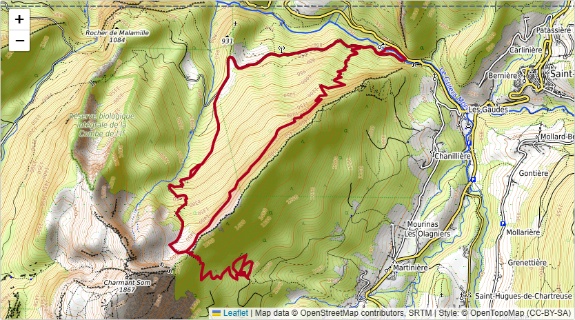
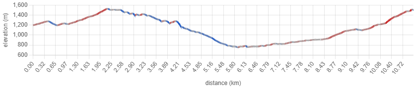

# steeproute

steeproute finds steep loop routes for hiking and trail running. You give it a center
point and a radius: `steeproute-setup` builds the local trail network from OpenStreetMap
and an auto-downloaded elevation model, and `steeproute` searches that network with a
GRASP optimizer for distinct loops that maximize sustained steepness, writing each as a
self-contained HTML report with an interactive map and elevation profile.

**Coverage:** trail data comes from OpenStreetMap (available for most of the world);
elevation is downloaded from the IGN RGE ALTI service, which covers **France**. There is
no option to supply a different elevation source yet, so in practice the tool works
anywhere in France. It is a personal project.

## Known Limitations

- **Phantom steepness near cliffs (data error).** Elevation is sampled from a 5 m DEM
  along OSM trail polylines. Where a trail's mapped line drifts toward a cliff edge, the
  sampled profile can pick up vertical relief that isn't on the actual tread, inflating
  the reported slope. Treat cliff-proximate routes as *ideas to verify* against a
  topographic map, not as ground truth.
- **GRASP finds "a good route," not "*the* route" (solver error).** The optimizer is a
  randomized heuristic (GRASP), not an exhaustive solver. CI pins a GRASP-vs-exhaustive
  ratio on a tiny controlled instance as a *regression* signal — it does **not** generalize
  to a claim of optimality on real-scale queries. A run returns strong loops it found, not
  a proof that none better exist.
- **Memory.** Runs comfortably on a commodity 16 GB laptop — the gallery regions peaked
  around 0.8 GB of working set per query. Memory pressure scales with prepared-area size,
  not search effort.
- **Platform.** Developed and tested on Windows. Linux is expected to work but is not
  actively tested; macOS is not a v1 commitment.

## Quickstart

steeproute is a [uv](docs/installation.md) project. Clone it and sync dependencies:

```sh
git clone https://github.com/yfontana/steeproute && cd steeproute
uv sync
```

It has two commands. **Setup** downloads and caches the trail network + elevation for an
area; **query** searches a prepared area and writes reports. For example, for the
Chamrousse area in the Belledonne massif:

```sh
# 1. Prepare the area (OSM trails + IGN elevation, cached on disk).
uv run steeproute-setup --center 45.12,5.88 --radius 6.5

# 2. Search it for up to N steep, distinct loops -> one HTML + JSON report per route.
uv run steeproute --center 45.12,5.88 --radius 6.0 \
    --difficulty-cap T4 --iter-budget 200000 --stagnation-iters 10000 \
    --elevation-deadband 1 --j-max 0 --n 3 --seed 42 --output-dir results
```

Then open `results/route-1.html` in a browser. Keep the query radius a little smaller
than the setup radius so the queried area sits fully inside the prepared one.

### Key parameters

| Flag | What it does | Suggested value |
|---|---|---|
| `--center` / `--radius` | area center `lat,lon` and radius in km | your area |
| `--theta` | route-level average-slope floor every route must clear | `0.20` — this *is* the steepness bar; raise it for steeper routes, lower it to admit gentler ones |
| `--difficulty-cap` | SAC hiking-scale ceiling for eligible trails | `T4` (the `T3` default filters out a lot of steep alpine terrain) |
| `--iter-budget` / `--stagnation-iters` | GRASP search budget / stop after this many iterations with no improvement | `200000` / `10000` — GRASP needs a large budget to converge; it usually stops on stagnation well before the cap |
| `--elevation-deadband` | drop up/down wiggles smaller than N metres when summing D+/D− | `1` (removes elevation-model noise from the climb totals) |
| `--n` / `--j-max` | how many routes to return / max segment overlap allowed between them (`0` = fully disjoint) | `3` / `0` |
| `--seed` | fixes GRASP's randomness so a run is reproducible | any integer |

See `uv run steeproute --help` and `uv run steeproute-setup --help` for the full set.

## Gallery

Three Grenoble-area examples, each one `steeproute` generation using the parameters
above. The thumbnails are the **top route (route 1)** of each generation — every region
returned three routes; the full set is under
[`docs/examples/`](docs/examples/), and [docs/examples/README.md](docs/examples/README.md)
lists the exact commands to reproduce them.

| Region | Map (route 1) | Elevation profile |
|---|---|---|
| **Chamrousse** — Belledonne massif<br>6 km radius · top of 3 routes · ~7 s query<br>route 1: 10.7 km, +1018 m, 26% avg slope<br>[Open report ▸](docs/examples/chamrousse/route-1.html) | [](docs/examples/chamrousse/route-1.html) |  |
| **Saint-Nizier-du-Moucherotte** — Vercors edge above Grenoble<br>6.5 km radius · top of 3 routes · ~32 s query<br>route 1: 7.5 km, +1042 m, 24% avg slope<br>[Open report ▸](docs/examples/saint-nizier/route-1.html) | [](docs/examples/saint-nizier/route-1.html) |  |
| **Col de Porte / Charmant Som** — Chartreuse<br>6 km radius · top of 3 routes · ~7 s query<br>route 1: 11.0 km, +1390 m, 22% avg slope<br>[Open report ▸](docs/examples/col-de-porte/route-1.html) | [](docs/examples/col-de-porte/route-1.html) |  |

> The reports are self-contained HTML — GitHub shows the source, so download and open
> them locally (or clone the repo) for the interactive map and hover-linked profile.

* * *

## Project Docs

For how to install uv and Python, see [installation.md](docs/installation.md).

For development workflows, see [development.md](docs/development.md).

For instructions on publishing to PyPI, see [publishing.md](docs/publishing.md).

* * *

## Development notes

### Pinned-regression goldens

Seeded GRASP is deterministic (FR29), so any change to a pinned fixture's output is a
behavior change worth noticing. `tests/e2e/test_pinned_regressions.py` runs `steeproute`
on each committed fixture cache (`tests/e2e/fixtures/<name>/cache/`) at an explicitly-pinned
param set + seed and compares a 5-field hash tuple per route (`objective`, `d_plus_m`,
`d_minus_m`, `edge_count`, `canonical_edge_sequence_hash`) against the committed golden in
`tests/e2e/goldens/<name>.json`. The match is **zero-tolerance**.

To intentionally update goldens after a justified behavior change:

```
uv run update-regression --all          # or: --fixture <name>
```

This re-runs the fixture(s), prints a before/after diff, and overwrites the golden file(s).

- **Any commit that updates a golden MUST state an explicit rationale in the commit message** —
  what behavior changed and why the new output is correct. Golden updates are never rubber-stamped.
- **Do not `pytest.skip` / `xfail` a pinned-regression test** to get a build green. If a gate must
  be disabled temporarily it requires an explicit issue reference and commit-message rationale
  (Architecture §Cat 11c).

### Performance benchmarks

`tests/benchmarks/` is a pytest-benchmark suite pinning throughput baselines: **seconds per
1k GRASP iterations** (fixed seed/params on the `grenoble_small` contracted graph) and per-stage
setup wall-clock on committed fixture data (offline — network stages are out of scope; their
baseline is the profiling capture in `_bmad-output/planning-artifacts/research/profiling/`).
Benchmarks measure time, never route output — quality regressions are the goldens' job above.
Excluded from the default test run (`benchmark` marker, same pattern as `live`/`slow`):

```
uv run pytest tests/benchmarks -m benchmark
```

Run it standalone as shown (not via bare `-m benchmark` from the repo root — `tests/unit` and
`tests/integration` can't be collected in one invocation), and without `--cov` (coverage
instrumentation distorts timings).

**Around every optimization commit:** compare against the saved baseline, then save the new one.

```
uv run pytest tests/benchmarks -m benchmark --benchmark-compare   # vs latest saved run
uv run pytest tests/benchmarks -m benchmark --benchmark-autosave  # pin the new baseline
```

Baselines live in `.benchmarks/` and are committed — but they are **machine-local**: numbers are
only comparable across runs on the same machine. The pre-optimization baseline (Epic 11, 2026-07-03)
is the reference point every Phase-3 optimization is judged against.

* * *

*This project was built from
[simple-modern-uv](https://github.com/jlevy/simple-modern-uv).*
