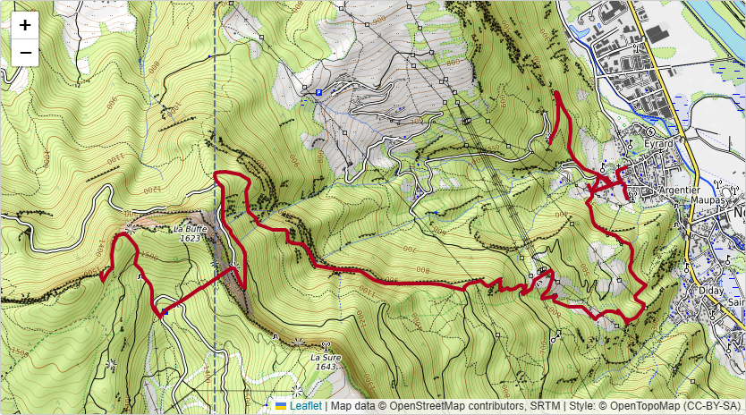
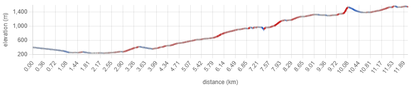
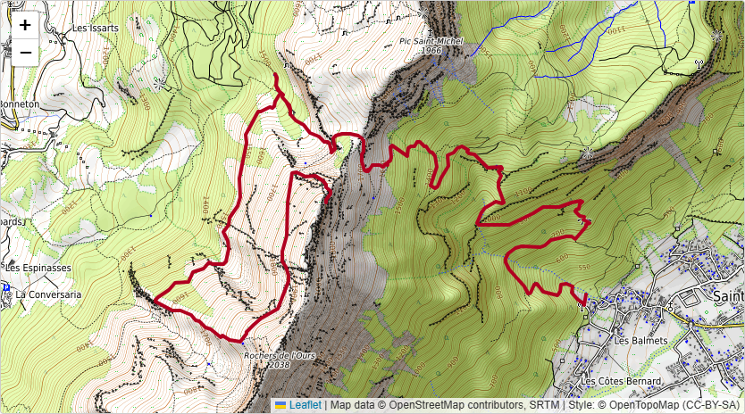
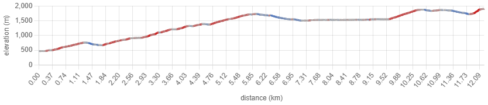
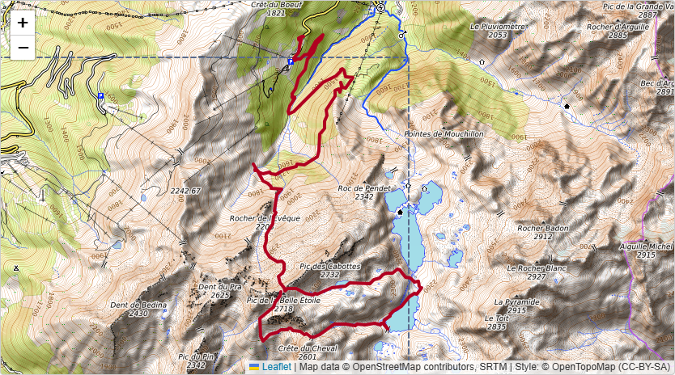
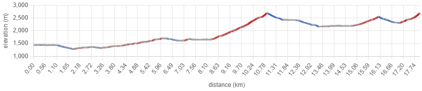

# steeproute

steeproute finds steep routes for hiking and trail running. You give it a center
point and a radius: `steeproute-setup` builds the local trail network from OpenStreetMap
and an auto-downloaded elevation model, and `steeproute` searches that network with a
GRASP optimizer for distinct routes that maximize sustained steepness, writing each as a
self-contained HTML report with an interactive map and elevation profile.

The routes are point-to-point **exploration aids, not ready-to-run loops** — they show
*where the vertical lives* in an area (often with awkward trailheads or long chained
climbs), and you sketch your actual outing from them.

**Coverage:** trail data comes from OpenStreetMap (available for most of the world);
elevation is downloaded from the IGN RGE ALTI service, which covers **France**. There is
no option to supply a different elevation source yet, so in practice the tool works
anywhere in France. It is a personal project.

## Known Limitations

- **Phantom steepness near cliffs (data error).** Elevation is sampled from a 5 m DEM
  along OSM trail polylines. Where a trail's mapped line drifts toward a cliff edge, the
  sampled profile can pick up vertical relief that isn't on the actual tread, inflating
  the reported slope. Treat cliff-proximate routes as *ideas to verify* against a
  topographic map, not as ground truth.
- **GRASP finds "a good route," not "*the* route" (solver error).** The optimizer is a
  randomized heuristic (GRASP), not an exhaustive solver. CI pins a GRASP-vs-exhaustive
  ratio on a tiny controlled instance as a *regression* signal — it does **not** generalize
  to a claim of optimality on real-scale queries. A run returns strong loops it found, not
  a proof that none better exist.
- **Memory.** Peak working set scales with two levers: the **prepared-area size** (a
  larger area is a larger in-memory graph) and **`--workers`** — each parallel GRASP
  worker holds its own copy of the search graph, so peak roughly grows with the worker
  count. A single-worker small-area query stays in the hundreds of MB; the large-area
  gallery runs (radius 16–20 km) with `--workers 4` peaked in the 3–3.5 GB range.
  Developed on a 32 GB laptop; if memory is tight, lower `--workers` or shrink the area —
  both cut peak.
- **Platform.** Developed and tested on Windows. Linux is expected to work but is not
  actively tested.

## Quickstart

steeproute is a [uv](docs/installation.md) project. Clone it and sync dependencies:

```sh
git clone https://github.com/yfontana/steeproute && cd steeproute
uv sync
```

The core workflow is two CLI commands. **Setup** downloads and caches the trail network +
elevation for an area; **query** searches a prepared area and writes reports. (There is
also a local [web app](#web-app) that wraps the same workflow behind a map.) For example,
for the Chamrousse area in the Belledonne massif:

```sh
# 1. Prepare the area (OSM trails + IGN elevation, cached on disk).
uv run steeproute-setup --center 45.12,5.88 --radius 6.5

# 2. Search it for up to N steep, distinct loops -> one HTML + JSON report per route.
uv run steeproute --center 45.12,5.88 --radius 6.0 \
    --difficulty-cap T4 --iter-budget 200000 --stagnation-iters 10000 \
    --elevation-deadband 1 --j-max 0 --n 3 --seed 42 --output-dir results
```

Then open `results/route-1.html` in a browser. Keep the query radius a little smaller
than the setup radius so the queried area sits fully inside the prepared one.

### Expected runtime

Runtime varies with the area, network services, search budget, and available CPU cores.
As a concrete larger-area example, on the author's Windows laptop (Intel Core Ultra 7
155U, 32 GB RAM), a Grenoble-area run produced:

| Workload | Parameters | Observed wall-clock |
|---|---|---:|
| Initial area setup (cache miss) | 20 km radius | 299.28 s (~5 min) |
| Query against that cache | 20 km radius, 1,000,000 iterations, 4 workers, 10 routes | 78.57 s (~1 min 19 s) |

Most of the initial setup time was network-bound: the OpenStreetMap download took
142.46 s and elevation download took 82.87 s. Those stages can vary substantially with
network conditions and upstream service load. Query time depends heavily on prepared-area
size and search parameters, so treat these figures as an order-of-magnitude example, not
a performance guarantee.

### Key parameters

| Flag | What it does | Suggested value |
|---|---|---|
| `--center` / `--radius` | area center `lat,lon` and radius in km | your area |
| `--theta` | route-level average-slope floor every route must clear | `0.20` — this *is* the steepness bar; raise it for steeper routes, lower it to admit gentler ones |
| `--difficulty-cap` | SAC hiking-scale ceiling for eligible trails | `T4` (the `T3` default filters out a lot of steep alpine terrain) |
| `--start-at-junction` | require each route to start at a road/trail junction (a realistic trailhead) rather than mid-trail | off by default; turn it on for routes you'd actually set off on from a road |
| `--max-descent-slope` | cap how steeply a route may *descend* (windowed, uphill-measured slope) while still allowing steep climbs | `0.4` keeps descents runnable instead of cliff-like; off by default |
| `--iter-budget` / `--stagnation-iters` | GRASP search budget / stop after this many iterations with no improvement | `1000000` / `200000` — GRASP needs a large budget to converge. Higher value means longer execution, but higher likelihood of convergence. The value required for convergence depends on area size and steep trail density. 1M iterations are usually enough to at least get close to convergence on a radius 20 area with fairly dense trails. |
| `--elevation-deadband` | drop up/down wiggles smaller than N metres when summing D+/D− | `1` (removes elevation-model noise from the climb totals) |
| `--n` / `--j-max` | how many routes to return / max segment overlap allowed between them (`0` = fully disjoint) | `3` / `0` |
| `--seed` | fixes GRASP's randomness so a run is reproducible | any integer |
| `--workers` | run independent GRASP restarts across CPU cores | `1` (default, single-process and byte-identical); set to your core count for a stronger search in the same wall-clock. `N>1` is reproducible per `(seed, workers)` but differs by design from single-process |

See `uv run steeproute --help` and `uv run steeproute-setup --help` for the full set.

## Web app

steeproute also ships a local web app that wraps the same setup + query workflow behind a
map. Pick an area by drawing on the map, configure and launch a query, watch progress
live, and browse past runs and their routes.

```sh
uv run steeproute-app
```

Then open <http://127.0.0.1:8000>. It runs a single background worker (one setup or query
job at a time) and everything stays on your machine.

## Gallery

Three Grenoble-area examples, each a full `steeproute` run with `--start-at-junction
--max-descent-slope 0.4` and a large parallel search budget (`--workers 4`, ~1M
iterations). The thumbnails are the **top route (route 1)** of each run — every region
returned three routes; the full set is under
[`docs/examples/`](docs/examples/), and [docs/examples/README.md](docs/examples/README.md)
lists the exact commands to reproduce them.

| Region | Map (route 1) | Elevation profile |
|---|---|---|
| **Chartreuse** — Chartreuse massif north of Grenoble<br>16 km radius · top of 3 routes · ~84 s query (`--workers 4`)<br>route 1: 12.0 km, +1787 m, -625m, 20% avg slope<br>[Open report ▸](docs/examples/chartreuse/route-1.html) | [](docs/examples/chartreuse/route-1.html) |  |
| **Vercors** — Vercors massif southwest of Grenoble<br>20 km radius · top of 3 routes · ~84 s query (`--workers 4`)<br>route 1: 12.2 km, +2058 m, -627m, 22% avg slope<br>[Open report ▸](docs/examples/vercors/route-1.html) | [](docs/examples/vercors/route-1.html) |  |
| **South Belledonne** — southern Belledonne massif<br>11 km radius · top of 3 routes · ~50 s query (`--workers 4`)<br>route 1: 18.0 km, +2454 m, -1217m, 20% avg slope<br>[Open report ▸](docs/examples/south-belledonne/route-1.html) | [](docs/examples/south-belledonne/route-1.html) |  |

> The reports are self-contained HTML — GitHub shows the source, so download and open
> them locally (or clone the repo) for the interactive map and hover-linked profile.

* * *

## Project Docs

For how to install uv and Python, see [installation.md](docs/installation.md).

For development workflows, see [development.md](docs/development.md).

For instructions on publishing to PyPI, see [publishing.md](docs/publishing.md).

* * *

## Development notes

### Pinned-regression goldens

Seeded GRASP is deterministic (FR29), so any change to a pinned fixture's output is a
behavior change worth noticing. `tests/e2e/test_pinned_regressions.py` runs `steeproute`
on each committed fixture cache (`tests/e2e/fixtures/<name>/cache/`) at an explicitly-pinned
param set + seed and compares a 5-field hash tuple per route (`objective`, `d_plus_m`,
`d_minus_m`, `edge_count`, `canonical_edge_sequence_hash`) against the committed golden in
`tests/e2e/goldens/<name>.json`. The match is **zero-tolerance**.

To intentionally update goldens after a justified behavior change:

```
uv run update-regression --all          # or: --fixture <name>
```

This re-runs the fixture(s), prints a before/after diff, and overwrites the golden file(s).

- **Any commit that updates a golden MUST state an explicit rationale in the commit message** —
  what behavior changed and why the new output is correct. Golden updates are never rubber-stamped.
- **Do not `pytest.skip` / `xfail` a pinned-regression test** to get a build green. If a gate must
  be disabled temporarily it requires an explicit issue reference and commit-message rationale
  (Architecture §Cat 11c).
